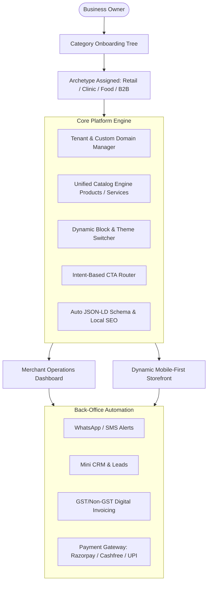
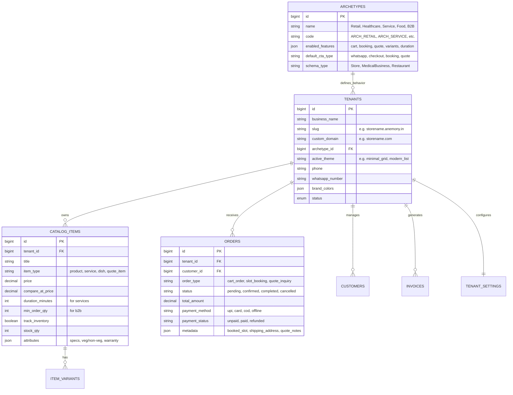
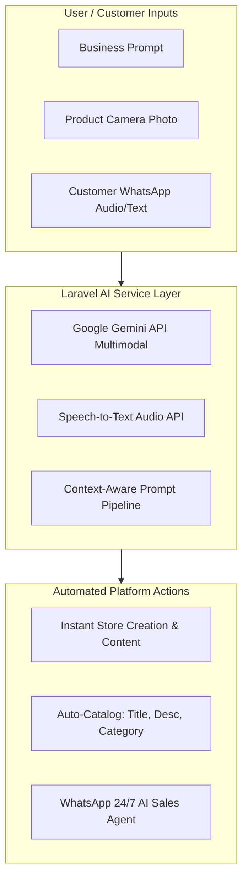

# 🚀 All-in-One MSME Operating System & Dynamic Website Builder
## Project Blueprint & Technical Architecture Plan (`anemony`)

---

## 1. Executive Summary & Core Philosophy

Yeh platform ek **Multi-Tenant No-Code Business Operating System** hai jo Indian MSMEs/SMBs (Retailers, Service Providers, Doctors, Cafes, Manufacturers) ko unki category ke hisaab se instant online presence aur back-office management deta hai.

### Core Philosophy: "Content & Presentation Decoupling"
* **Data Layer (Backend):** Catalog (items, prices, descriptions), Customers, Invoices, aur Orders centralized database me safe rehte hain.
* **Presentation Layer (Frontend):** Themes/Layouts sirf dynamic presentation templates hain. User jab bhi theme change karta hai, **data 0% loss** hota hai, sirf UI layout aur CSS styling switch hoti hai.

---

## 2. Core Architecture Modules

---

## 3. Detailed Architectural Components

### A. Industry Onboarding Tree (Category Mapping)
Jab merchant sign-up karta hai:
1. **Primary Vertical:** `Retail`, `Healthcare`, `Services`, `Hospitality`, `Manufacturing/B2B`
2. **Micro-Category:** `Kirana/Grocery`, `Dental Clinic`, `Salon/Spa`, `Cafe/Restaurant`, `Factory/Machinery`

System DB me tenant ko ek **Archetype ID** assign karta hai:
* `ARCH_RETAIL`: Add-to-cart, variants (size/color), inventory stock, pin code delivery checker, WhatsApp buy.
* `ARCH_SERVICE`: Service duration (mins), time-slot booking calendar, practitioner profile, consultation fees.
* `ARCH_FOOD`: Digital menu, dine-in/takeaway switch, veg/non-veg tags, spice level indicators.
* `ARCH_B2B`: "Request Quote" modal, MOQ (Minimum Order Quantity), Bulk tiered pricing, PDF catalog download.

---

### B. Intent-Based CTA Routing Engine
Storefront ke main action buttons category aur merchant preference ke according dynamically route hote hain:

| Category Archetype | Primary CTA | Action / Destination |
| :--- | :--- | :--- |
| **Retail (Fast-Track)** | "Order on WhatsApp" | Pre-filled cart WhatsApp message generator with customer details & address |
| **Retail (Standard E-com)** | "Buy Now / Add to Cart" | In-app checkout flow with Online Payment (UPI/Cards) or COD |
| **Clinics / Salons** | "Book Appointment" | Interactive slot selector modal $\rightarrow$ Booking confirmation |
| **B2B / Wholesalers** | "Request a Quote" | Lead capture popup with Quantity + Custom requirements |
| **Consultants / Real Estate**| "Inquire Now / Call" | Direct click-to-call / WhatsApp lead router into Mini CRM |

---

### C. Dynamic Section Rendering (Block-Based Storefront)
Storefront monolithic static page nahi hai. Yeh modular components se render hota hai:
* `HeroBannerBlock`
* `CategoryPillsBlock`
* `CatalogGridBlock` (Settings: shows weight/unit for retail, duration for services, MOQ for B2B)
* `BookingCalendarBlock` (Enabled only for appointments)
* `CustomerReviewsBlock` (Synced with Google Reviews / internal reviews)
* `ContactAndMapBlock` (Google Business Profile location & hours)
* `StickyBottomBar` (Instant Call / WhatsApp / Cart toggle)

---

### D. Automated Local SEO & Schema.org (JSON-LD)
Page ke `<head>` tag me category ke hisaab se dynamically structured data script inject hota hai:
* Clinic $\rightarrow$ `schema.org/MedicalBusiness` + doctor credentials
* Restaurant $\rightarrow$ `schema.org/Restaurant` + `servesCuisine` + operating hours
* Retail $\rightarrow$ `schema.org/Store` + `schema.org/Product` with real-time `Offer`, `priceCurrency: INR`, `availability`
* Automatically generates dynamic `sitemap.xml` and `robots.txt` for every tenant.

---

## 4. Database Schema Design (High-Level Entity Relationship)

---

## 5. Technology Stack Recommendations

| Component | Recommended Tech Stack | Reason |
| :--- | :--- | :--- |
| **Backend Framework** | **Laravel 11+ (PHP 8.3)** | Ultra-fast routing, robust ORM, built-in Queues, Events, Notifications |
| **Multi-Tenancy** | **Custom Subdomain/Domain Scope or `stancl/tenancy`** | Single-database multi-tenant scoping for cost efficiency & scalability |
| **Merchant Dashboard** | **FilamentPHP v3** | Industry-standard TALL-stack admin panel (Super fast to build CRM, Products, Invoices) |
| **Storefront Frontend** | **Blade + Alpine.js + Tailwind CSS** | Ultra-lightweight, 95+ Google PageSpeed score on mobile 4G networks |
| **Custom Domains & SSL** | **Caddy Web Server OR Cloudflare for SaaS** | Automated zero-configuration SSL issuance for custom merchant domains |
| **Payments** | **Razorpay / Cashfree / PhonePe Gateway** | Seamless Indian UPI QR, intent flow, Cards & NetBanking |
| **WhatsApp Automation** | **WhatsApp Cloud API / Wati / Interakt** | Official Meta Cloud API with fallback to WhatsApp Click-to-Chat links |
| **Invoicing PDF** | **`barryvdh/laravel-dompdf` or Browsershot** | Fast GST/Non-GST receipt and tax invoice generation |

---

## 6. Phased Implementation Roadmap

### Phase 1: Foundation & Multi-Tenancy (Week 1-2)
- [ ] Laravel 11 project setup with PHP 8.3.
- [ ] Tenant model, domain routing middleware (`tenant.domain.com` and custom domain mapping).
- [ ] Authentication system (Merchant Auth + OTP Login).
- [ ] Industry Onboarding Wizard (Vertical & Micro-category selection $\rightarrow$ Archetype assignment).

### Phase 2: Unified Catalog & Dynamic Engine (Week 3-4)
- [ ] Catalog Management in Filament Admin (Products, Services, Variants, Pricing).
- [ ] Conditional field rendering based on Archetype (Hide duration for retail, hide weight for doctor).
- [ ] Dynamic Block Storefront layout (Blade components + Tailwind).
- [ ] Multiple Storefront Themes (e.g. `classic_grid`, `modern_service`, `minimal_b2b`).
- [ ] Theme Switcher: switch visual design with zero data loss.

### Phase 3: Conversions & CTA Workflows (Week 5-6)
- [ ] Fast WhatsApp Order link generator with structured cart summary.
- [ ] Standard Shopping Cart & Checkout with Indian Address & Pincode validator.
- [ ] Appointment Booking System with flexible slots (Date, Time, Provider).
- [ ] "Request a Quote" modal with instant email/SMS alert to merchant.
- [ ] Dynamic JSON-LD Schema.org generator for Google Rich Results.

### Phase 4: Omnichannel Operations, CRM & Billing (Week 7-8)
- [ ] Unified Orders & Inquiries Inbox (Orders, Bookings, Leads ek dashboard me).
- [ ] Mini CRM: Customer profiles, purchase frequency, lead pipeline stages.
- [ ] Digital Invoicing: GST/Non-GST calculation, PDF generation, public link sharing (`/invoice/{token}`).
- [ ] Payment Gateway integration (UPI QR & Online Payments).

### Phase 5: Automations, Marketing & Domains (Week 9-10)
- [ ] WhatsApp Webhook alerts (Order placed, Booking confirmed, Delivery update).
- [ ] Abandoned cart reminder webhook/trigger.
- [ ] Custom domain DNS verification (CNAME/A record checker).
- [ ] Merchant Analytics Dashboard (Daily visitors, GMV, top products, conversion rate).

---

## 8. AI Engine & Next-Gen API Architecture (AI Superpowers)

Small business owners ke paas content likhne, professional photos edit karne, ya din bhar WhatsApp par chat karne ka time nahi hota. Yeh platform AI APIs ka use karke unka **90% manual kaam automate** karega:

### Core AI Features:
1. **AI 1-Click Store Generator (Prompt $\rightarrow$ Website):**
   * Merchant sirf bolega: *"Kanpur me meri 'Sharma Sweets' dukaan hai, authentic desi ghee mithai aur snacks bechte hain."*
   * AI automatically generate karega: Store Tagline, About Us story, 15 pre-populated products with prices, SEO meta tags, aur matching color palette.

2. **AI Vision: Snap & List (Photo $\rightarrow$ Product Listing):**
   * Dukaandar apne mobile camera se product ki photo upload karega.
   * Gemini Vision API photo dekh kar automatically nikalega:
     * Product Title & Bullet Points
     * Accurate Category & Sub-category
     * Suggested Price & Variants (e.g., 500g, 1kg)

3. **24/7 AI WhatsApp Sales Agent (Hinglish/Local Languages):**
   * Customer WhatsApp par poochhe: *"Bhaiya sugar-free kaju katli hai kya? Kitne ki hai?"*
   * AI Agent real-time me database check karega aur reply karega: *"Haan ji! Sugar-free Kaju Katli ₹900/kg me available hai. Order karne ke liye yahan click karein: [Payment Link]"*

4. **AI Voice-to-Order (Audio Notes):**
   * WhatsApp audio message sun kar items extract karna aur automatically shopping cart me add karna.

5. **AI Review Auto-Responder & Local SEO Engine:**
   * Google Business Profile par aane wale 5-star ya negative reviews ka polite, professional reply auto-draft karna.

### API & Modern Tech Choices:
* **LLM Engine:** Google Gemini Flash API (Multimodal, Ultra-fast, **Generous Free Tier** without high costs).
* **API Architecture:** Laravel RESTful APIs (`/api/v1/`) secured with **Laravel Sanctum** tokens.
* **Async Processing:** Laravel Queues (Redis/Database) taaki AI generation ke waqt user ka UI freeze na ho.

